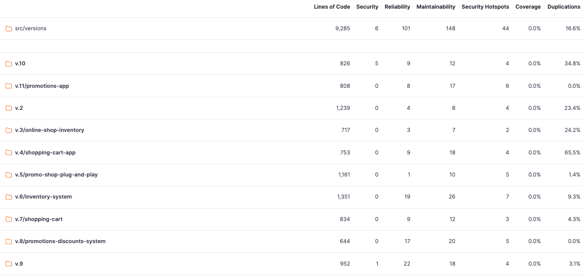

# SonarQube Code Quality Analysis Report

## 📊 สรุปภาพรวม

รายงานนี้แสดงผลการวิเคราะห์คุณภาพโค้ดจาก SonarQube สำหรับทุกเวอร์ชันใน `src/versions`

**วันที่วิเคราะห์:** 2026-01-24  
**เครื่องมือ:** SonarQube  
**เปรียบเทียบกับ:** [CODE_REVIEW.md](../CODE_REVIEW.md)

### 🔗 เอกสารที่เกี่ยวข้อง
- [Code Review Analysis](../CODE_REVIEW.md) - การทบทวนโค้ดแบบละเอียด
- [Version Analysis Notebook](../version_analysis.ipynb) - กราฟวิเคราะห์การพัฒนา

---

## 📈 สรุปผลรวม (Aggregate: src/versions)

| Metric | Value |
|--------|-------|
| **Lines of Code** | 9,285 |
| **Security Vulnerabilities** | 6 ⚠️ |
| **Reliability Issues (Bugs)** | 101 ⚠️ |
| **Maintainability Issues (Code Smells)** | 148 ⚠️ |
| **Security Hotspots** | 44 🔍 |
| **Test Coverage** | 0.0% ❌ |
| **Code Duplications** | 16.6% ⚠️ |

### 📝 ข้อสังเกต
- มี Security vulnerabilities 6 จุดที่ต้องแก้ไข (ส่วนใหญ่อยู่ใน v.10: 5 จุด)
- มี Reliability issues (bugs) 101 จุด - ควรแก้ไขโดยเฉพาะ v.9 (22 จุด) และ v.6 (19 จุด)
- ไม่มี Test Coverage (0.0%) - **ปัญหาสำคัญ** ควรเพิ่มการทดสอบสำหรับทุกเวอร์ชัน
- Code Duplications 16.6% - มีโค้ดซ้ำที่ควร refactor โดยเฉพาะ v.4 (65.5%) และ v.10 (34.8%)
- v.11 และ v.8 มี Code Duplications = 0.0% - เป็นตัวอย่างที่ดี

---

## 📋 ผลการวิเคราะห์รายเวอร์ชัน

### v.2 (inventory_full_version)

| Metric | Value | Status |
|--------|-------|--------|
| Lines of Code | 1,239 | - |
| Security | 0 | ✅ |
| Reliability | 4 | ✅ |
| Maintainability | 8 | ✅ |
| Security Hotspots | 4 | ⚠️ |
| Coverage | 0.0% | ❌ |
| Duplications | 23.4% | ⚠️ |

**สรุป:** 
- ✅ ไม่มี Security vulnerabilities
- ✅ Reliability และ Maintainability อยู่ในระดับดี
- ⚠️ Code Duplications สูง (23.4%) - ควร refactor
- ❌ ไม่มี Test Coverage

**เปรียบเทียบกับ Code Review:** ⭐⭐☆☆☆ (2/5) - เริ่มต้น มีโครงสร้างพื้นฐาน แต่ยังขาด features สำคัญ

---

### v.3 (online-shop-inventory)

| Metric | Value | Status |
|--------|-------|--------|
| Lines of Code | 717 | - |
| Security | 0 | ✅ |
| Reliability | 3 | ✅ |
| Maintainability | 7 | ✅ |
| Security Hotspots | 2 | ✅ |
| Coverage | 0.0% | ❌ |
| Duplications | 24.2% | ⚠️ |

**สรุป:**
- ✅ คุณภาพดี - ไม่มี Security issues
- ✅ Reliability และ Maintainability ดีมาก (Reliability: 3, Maintainability: 7 - ต่ำที่สุด)
- ⚠️ Code Duplications สูง (24.2%)
- ❌ ไม่มี Test Coverage

**เปรียบเทียบกับ Code Review:** ⭐⭐⭐☆☆ (3/5) - เริ่มมี Docker, Tests, แต่ยังไม่มี Validation

---

### v.4 (shopping-cart-app)

| Metric | Value | Status |
|--------|-------|--------|
| Lines of Code | 753 | - |
| Security | 0 | ✅ |
| Reliability | 9 | ⚠️ |
| Maintainability | 18 | ⚠️ |
| Security Hotspots | 4 | ⚠️ |
| Coverage | 0.0% | ❌ |
| Duplications | **65.5%** | ❌ |

**สรุป:**
- ✅ ไม่มี Security vulnerabilities
- ⚠️ Reliability issues เพิ่มขึ้น (9 จุด)
- ⚠️ Maintainability issues เพิ่มขึ้น (18 จุด)
- ❌ **Code Duplications สูงมาก (65.5%)** - ต้อง refactor เร่งด่วน
- ❌ ไม่มี Test Coverage

**⚠️ ข้อควรระวัง:** v.4 มี Code Duplications สูงที่สุดในทุกเวอร์ชัน (65.5%) ควรพิจารณา refactor

**เปรียบเทียบกับ Code Review:** ⭐⭐⭐⭐☆ (4/5) - มี Zod validation, ES Modules, Row Locking, Transaction helper แต่ Code Duplications สูงมาก

---

### v.5 (promo-shop-plug-and-play)

| Metric | Value | Status |
|--------|-------|--------|
| Lines of Code | 1,161 | - |
| Security | 0 | ✅ |
| Reliability | 1 | ✅ |
| Maintainability | 10 | ✅ |
| Security Hotspots | 5 | ⚠️ |
| Coverage | 0.0% | ❌ |
| Duplications | 1.4% | ✅ |

**สรุป:**
- ✅ คุณภาพดีมาก - Reliability issues น้อยที่สุด (1 จุด)
- ✅ Code Duplications ต่ำมาก (1.4%) - โค้ดสะอาด
- ✅ Maintainability ดี
- ⚠️ Security Hotspots 5 จุด - ควรตรวจสอบ
- ❌ ไม่มี Test Coverage

**⭐ จุดเด่น:** v.5 มี Code Duplications ต่ำที่สุด (1.4%) และ Reliability issues น้อยที่สุด (1 จุด)

**เปรียบเทียบกับ Code Review:** ⭐⭐⭐☆☆ (3/5) - Frontend ใช้ TypeScript แต่ Backend ยังใช้ CommonJS และไม่มี Zod validation

---

### v.6 (inventory-system)

| Metric | Value | Status |
|--------|-------|--------|
| Lines of Code | 1,351 | - |
| Security | 0 | ✅ |
| Reliability | 19 | ⚠️ |
| Maintainability | 26 | ⚠️ |
| Security Hotspots | 7 | ⚠️ |
| Coverage | 0.0% | ❌ |
| Duplications | 9.3% | ✅ |

**สรุป:**
- ✅ ไม่มี Security vulnerabilities
- ⚠️ Reliability issues สูง (19 จุด) - ต้องแก้ไข
- ⚠️ Maintainability issues สูง (26 จุด) - ต้องปรับปรุง
- ⚠️ Security Hotspots 7 จุด - ควรตรวจสอบ
- ✅ Code Duplications อยู่ในระดับดี (9.3%)
- ❌ ไม่มี Test Coverage

**⚠️ ข้อควรระวัง:** v.6 มี Reliability และ Maintainability issues สูงที่สุดในบางเวอร์ชัน (Reliability: 19, Maintainability: 26)

**เปรียบเทียบกับ Code Review:** ⭐⭐⭐⭐☆ (4/5) - มี Concurrency Safety (FOR UPDATE), Atomic Transactions แต่ SonarQube พบ Reliability และ Maintainability issues สูง

---

### v.7 (shopping-cart)

| Metric | Value | Status |
|--------|-------|--------|
| Lines of Code | 834 | - |
| Security | 0 | ✅ |
| Reliability | 9 | ⚠️ |
| Maintainability | 12 | ⚠️ |
| Security Hotspots | 3 | ✅ |
| Coverage | 0.0% | ❌ |
| Duplications | 4.3% | ✅ |

**สรุป:**
- ✅ ไม่มี Security vulnerabilities
- ⚠️ Reliability issues 9 จุด
- ⚠️ Maintainability issues 12 จุด
- ✅ Code Duplications ต่ำ (4.3%)
- ❌ ไม่มี Test Coverage

**เปรียบเทียบกับ Code Review:** ⭐⭐⭐☆☆ (3/5) - มี Stock Guard, Integer Cents Math, Docker แต่โครงสร้างยังไม่ชัดเจน

---

### v.8 (promotions-discounts-system)

| Metric | Value | Status |
|--------|-------|--------|
| Lines of Code | 644 | - |
| Security | 0 | ✅ |
| Reliability | 17 | ⚠️ |
| Maintainability | 20 | ⚠️ |
| Security Hotspots | 5 | ⚠️ |
| Coverage | 0.0% | ❌ |
| Duplications | 0.0% | ✅ |

**สรุป:**
- ✅ ไม่มี Security vulnerabilities
- ✅ **Code Duplications = 0.0%** - ไม่มีโค้ดซ้ำเลย! ⭐
- ⚠️ Reliability issues สูง (17 จุด)
- ⚠️ Maintainability issues สูง (20 จุด)
- ❌ ไม่มี Test Coverage

**⭐ จุดเด่น:** v.8 ไม่มี Code Duplications เลย (0.0%) - โค้ดสะอาดมาก

**เปรียบเทียบกับ Code Review:** ⭐⭐⭐⭐☆ (4/5) - มี Order of Operations Safe, Integer Satang Math, Error Handler Middleware แต่ยังไม่มี Zod validation

---

### v.9

| Metric | Value | Status |
|--------|-------|--------|
| Lines of Code | 952 | - |
| Security | **1** | ⚠️ |
| Reliability | 22 | ❌ |
| Maintainability | 18 | ⚠️ |
| Security Hotspots | 4 | ⚠️ |
| Coverage | 0.0% | ❌ |
| Duplications | 3.1% | ✅ |

**สรุป:**
- ⚠️ **มี Security vulnerability 1 จุด** - ต้องแก้ไขเร่งด่วน
- ❌ Reliability issues สูงมาก (22 จุด) - สูงที่สุดในบางเวอร์ชัน
- ⚠️ Maintainability issues 18 จุด
- ✅ Code Duplications ต่ำ (3.1%)
- ❌ ไม่มี Test Coverage

**⚠️ ข้อควรระวัง:** v.9 มี Security vulnerability (1 จุด) และ Reliability issues สูงมาก (22 จุด - สูงที่สุด)

**เปรียบเทียบกับ Code Review:** ⭐⭐⭐⭐☆ (4/5) - มี API endpoints, Alert System, Error Handler แต่ SonarQube พบ Security vulnerability และ Reliability issues สูง

---

### v.10

| Metric | Value | Status |
|--------|-------|--------|
| Lines of Code | 826 | - |
| Security | **5** | ❌ |
| Reliability | 9 | ⚠️ |
| Maintainability | 12 | ⚠️ |
| Security Hotspots | 4 | ⚠️ |
| Coverage | 0.0% | ❌ |
| Duplications | **34.8%** | ❌ |

**สรุป:**
- ❌ **Security vulnerabilities สูงมาก (5 จุด)** - ต้องแก้ไขเร่งด่วน
- ⚠️ Reliability issues 9 จุด
- ⚠️ Maintainability issues 12 จุด
- ❌ **Code Duplications สูงมาก (34.8%)** - ต้อง refactor
- ❌ ไม่มี Test Coverage

**⚠️ ข้อควรระวัง:** v.10 มี Security vulnerabilities สูงที่สุด (5 จุด) และ Code Duplications สูง (34.8%)

**เปรียบเทียบกับ Code Review:** ⭐⭐⭐⭐☆ (4/5) - มี ES Modules, Zod Validation, Transaction Helper แต่ SonarQube พบ Security vulnerabilities สูงมาก (5 จุด) และ Code Duplications สูง (34.8%)

---

### v.11 (promotions-app) ⭐ **Best Version**

| Metric | Value | Status |
|--------|-------|--------|
| Lines of Code | 808 | - |
| Security | 0 | ✅ |
| Reliability | 8 | ✅ |
| Maintainability | 17 | ⚠️ |
| Security Hotspots | 6 | ⚠️ |
| Coverage | 0.0% | ❌ |
| Duplications | **0.0%** | ✅ |

**สรุป:**
- ✅ **ไม่มี Security vulnerabilities** - ปลอดภัยที่สุด
- ✅ Reliability issues ต่ำ (8 จุด) - ดีมาก
- ⚠️ Maintainability issues 17 จุด - ควรปรับปรุง
- ✅ **Code Duplications = 0.0%** - ไม่มีโค้ดซ้ำเลย! ⭐
- ⚠️ Security Hotspots 6 จุด - ควรตรวจสอบ
- ❌ ไม่มี Test Coverage

**⭐ จุดเด่น:** 
- v.11 ไม่มี Security vulnerabilities และ Code Duplications = 0.0%
- Reliability ดีมาก (8 จุด)
- เป็นเวอร์ชันที่มีคุณภาพดีที่สุดตาม CODE_REVIEW.md (5⭐)

**เปรียบเทียบกับ Code Review:** ⭐⭐⭐⭐⭐ (5/5) - **Best Version**
- ✅ Repository Pattern + Service Layer (Clean Architecture)
- ✅ Error Factory Pattern
- ✅ Zod Validation
- ✅ Money Utilities
- ✅ Comprehensive Tests
- ✅ SonarQube: Security = 0, Duplications = 0.0%, Reliability = 8 (ดีมาก)

---

## 📊 สรุปเปรียบเทียบ

### 🏆 เวอร์ชันที่ดีที่สุด (Best Versions)

1. **v.11** ⭐⭐⭐⭐⭐ - ไม่มี Security issues, Code Duplications = 0.0%, Reliability ดี (8), Clean Architecture
2. **v.5** ⭐⭐⭐☆☆ - Reliability issues น้อยที่สุด (1 จุด), Code Duplications ต่ำ (1.4%)
3. **v.8** ⭐⭐⭐⭐☆ - Code Duplications = 0.0%, ไม่มี Security issues, Error Middleware
4. **v.3** ⭐⭐⭐☆☆ - Maintainability ดีที่สุด (7 จุด), Reliability ดี (3 จุด)

### 📊 เปรียบเทียบ SonarQube vs Code Review

| Version | SonarQube Score | Code Review Score | ความสอดคล้อง |
|---------|----------------|-------------------|---------------|
| v.11 | ⭐⭐⭐⭐⭐ (Security: 0, Duplications: 0.0%, Reliability: 8) | ⭐⭐⭐⭐⭐ | ✅ สอดคล้อง - ดีที่สุดทั้งสอง |
| v.5 | ⭐⭐⭐⭐ (Reliability: 1, Duplications: 1.4%) | ⭐⭐⭐☆☆ | ⚠️ SonarQube ดีกว่า - Reliability ดีมาก |
| v.6 | ⭐⭐ (Reliability: 19, Maintainability: 26) | ⭐⭐⭐⭐☆ | ⚠️ Code Review ดีกว่า - มี Concurrency Safety |
| v.4 | ⭐⭐ (Duplications: 65.5%) | ⭐⭐⭐⭐☆ | ⚠️ Code Review ดีกว่า - มี Zod, ES Modules แต่ Duplications สูง |
| v.10 | ⭐ (Security: 5, Duplications: 34.8%) | ⭐⭐⭐⭐☆ | ❌ SonarQube แย่กว่า - Security issues สูง |

### ⚠️ เวอร์ชันที่ต้องแก้ไขเร่งด่วน

1. **v.10** ⚠️⚠️⚠️ - Security vulnerabilities สูงสุด (5 จุด), Code Duplications สูง (34.8%)
   - แม้ Code Review ให้ 4⭐ แต่ SonarQube พบ Security issues สูงมาก
2. **v.4** ⚠️⚠️ - Code Duplications สูงมาก (65.5%)
   - มี features ดี (Zod, ES Modules) แต่ Code Duplications สูงมาก
3. **v.9** ⚠️⚠️ - มี Security vulnerability (1 จุด), Reliability issues สูงมาก (22 จุด - สูงที่สุด)
4. **v.6** ⚠️ - Reliability issues สูง (19 จุด), Maintainability issues สูง (26 จุด - สูงที่สุด)
   - แม้มี Concurrency Safety แต่ SonarQube พบ issues สูง

### 📈 สถิติที่น่าสนใจ

| Metric | Best | Worst |
|--------|------|-------|
| **Security** | v.2, v.3, v.5, v.6, v.7, v.8, v.11 (0) | v.10 (5) |
| **Reliability** | v.5 (1) | v.9 (22) |
| **Maintainability** | v.3 (7) | v.6 (26) |
| **Code Duplications** | v.8, v.11 (0.0%) | v.4 (65.5%) |

---

## 🔍 Security Analysis

### Security Vulnerabilities โดยรวม: 6 จุด

- **v.9**: 1 จุด
- **v.10**: 5 จุด (สูงสุด)
- **v.2, v.3, v.4, v.5, v.6, v.7, v.8, v.11**: 0 จุด ✅

### Security Hotspots: 44 จุด

ต้องตรวจสอบและแก้ไข:
- v.6: 7 จุด (สูงสุด)
- v.11: 6 จุด
- v.5: 5 จุด
- v.8: 5 จุด
- v.4: 4 จุด
- v.10: 4 จุด
- v.2: 4 จุด
- v.9: 4 จุด
- v.3: 2 จุด
- v.7: 3 จุด

---

## 🐛 Reliability Analysis

### Reliability Issues (Bugs): 101 จุด

**เวอร์ชันที่มี Reliability issues สูง:**
- v.9: 22 จุด (สูงสุด)
- v.6: 19 จุด
- v.8: 17 จุด
- v.4: 9 จุด
- v.7: 9 จุด
- v.10: 9 จุด
- v.11: 8 จุด
- v.5: 1 จุด (ดีที่สุด)

**คำแนะนำ:** ควรแก้ไข Reliability issues โดยเฉพาะ v.9 และ v.6

---

## 🧹 Maintainability Analysis

### Maintainability Issues (Code Smells): 148 จุด

**เวอร์ชันที่มี Maintainability issues สูง:**
- v.6: 26 จุด (สูงสุด)
- v.8: 20 จุด
- v.4: 18 จุด
- v.9: 18 จุด
- v.11: 17 จุด
- v.5: 10 จุด
- v.7: 12 จุด
- v.10: 12 จุด
- v.3: 7 จุด (ดีที่สุด)
- v.2: 8 จุด

**คำแนะนำ:** ควร refactor โค้ดเพื่อลด Code Smells โดยเฉพาะ v.6

---

## 📋 Code Duplications Analysis

### Code Duplications: 16.6% (เฉลี่ย)

**เวอร์ชันที่มี Code Duplications:**
- ❌ **v.4: 65.5%** (สูงสุด - ต้อง refactor เร่งด่วน)
- ❌ **v.10: 34.8%** (สูง - ต้อง refactor)
- ⚠️ v.2: 23.4%
- ⚠️ v.3: 24.2%
- ✅ v.6: 9.3%
- ✅ v.7: 4.3%
- ✅ v.9: 3.1%
- ✅ v.5: 1.4%
- ✅ **v.8: 0.0%** (ดีที่สุด)
- ✅ **v.11: 0.0%** (ดีที่สุด)

**คำแนะนำ:** 
- v.4 และ v.10 ควร refactor เพื่อลด Code Duplications
- v.8 และ v.11 เป็นตัวอย่างที่ดี - ไม่มี Code Duplications เลย

---

## ❌ Test Coverage Analysis

### Test Coverage: 0.0% (ทุกเวอร์ชัน)

**⚠️ ปัญหาสำคัญ:** ไม่มีเวอร์ชันไหนมี Test Coverage เลย

**คำแนะนำ:**
- ควรเพิ่ม Unit Tests สำหรับทุกเวอร์ชัน
- ควรเพิ่ม Integration Tests
- ตั้งเป้า Coverage อย่างน้อย 70-80%

---

## 📊 สรุปและคำแนะนำ

### ✅ จุดเด่น

1. **v.11** ⭐⭐⭐⭐⭐ - คุณภาพดีที่สุดทั้ง SonarQube และ Code Review
   - SonarQube: Security = 0, Duplications = 0.0%, Reliability = 8
   - Code Review: 5⭐ - Clean Architecture, Repository Pattern, Error Factory
   
2. **v.5** - Reliability ดีมาก: Reliability issues น้อยที่สุด (1 จุด), Code Duplications ต่ำ (1.4%)
   - SonarQube metrics ดีมาก แต่ Code Review พบว่า Backend ยังใช้ CommonJS
   
3. **v.8** - Code Duplications = 0.0%: ไม่มีโค้ดซ้ำ, ไม่มี Security issues
   - มี Error Middleware, Integer Satang Math แต่ยังไม่มี Zod validation
   
4. **v.3** - Maintainability ดีที่สุด (7 จุด), Reliability ดี (3 จุด)
   - เริ่มต้นที่ดี แต่ยังไม่มี Validation และ Error Handling ที่เป็นระบบ

### ⚠️ จุดที่ต้องแก้ไข

1. **Security Vulnerabilities**
   - v.10: 5 จุด - ต้องแก้ไขเร่งด่วน
   - v.9: 1 จุด - ต้องแก้ไข

2. **Code Duplications**
   - v.4: 65.5% - ต้อง refactor เร่งด่วน
   - v.10: 34.8% - ต้อง refactor

3. **Reliability Issues**
   - v.9: 22 จุด - ต้องแก้ไข
   - v.6: 19 จุด - ต้องแก้ไข

4. **Test Coverage**
   - ทุกเวอร์ชัน: 0.0% - ต้องเพิ่มการทดสอบ

### 🎯 Action Items

#### 1. **เร่งด่วน (High Priority)** 🔴

**Security Issues:**
- ✅ **v.10: แก้ไข Security vulnerabilities 5 จุด** - สูงสุดในทุกเวอร์ชัน
- ✅ **v.9: แก้ไข Security vulnerability 1 จุด**

**Code Duplications:**
- ✅ **v.4: Refactor เพื่อลด Code Duplications (65.5% → <10%)** - สูงที่สุด
- ✅ **v.10: Refactor เพื่อลด Code Duplications (34.8% → <10%)**

#### 2. **สำคัญ (Medium Priority)** 🟡

**Reliability Issues:**
- ✅ **v.9: แก้ไข Reliability issues 22 จุด** - สูงที่สุด
- ✅ **v.6: แก้ไข Reliability issues 19 จุด**

**Maintainability Issues:**
- ✅ **v.6: ลด Maintainability issues (26 จุด → <15)** - สูงที่สุด
- ✅ **v.8: ลด Maintainability issues (20 จุด → <15)**

**Security Hotspots:**
- ✅ ตรวจสอบ Security Hotspots ทั้งหมด 44 จุด โดยเฉพาะ v.6 (7 จุด) และ v.11 (6 จุด)

#### 3. **ควรทำ (Low Priority)** 🟢

**Test Coverage:**
- ⚠️ **เพิ่ม Test Coverage สำหรับทุกเวอร์ชัน (เป้าหมาย: 70-80%)**
  - ปัจจุบัน: 0.0% ทุกเวอร์ชัน
  - ควรเริ่มจาก v.11, v.4, v.6 ที่มี test files อยู่แล้ว

**Best Practices:**
- ใช้ v.11 และ v.8 เป็น reference สำหรับ Code Duplications = 0.0%
- ใช้ v.5 เป็น reference สำหรับ Reliability (1 จุด)
- ใช้ v.3 เป็น reference สำหรับ Maintainability (7 จุด)

---

## 📝 หมายเหตุ

### คำอธิบาย Metrics

- **Security**: จำนวนช่องโหว่ด้านความปลอดภัยที่พบ (ยิ่งต่ำยิ่งดี)
- **Reliability**: จำนวน bugs ที่อาจทำให้ระบบล้มเหลว (ยิ่งต่ำยิ่งดี)
- **Maintainability**: จำนวน code smells ที่ทำให้โค้ดยากต่อการดูแลรักษา (ยิ่งต่ำยิ่งดี)
- **Security Hotspots**: จุดที่ต้องตรวจสอบด้านความปลอดภัยด้วยตนเอง (ต้อง review manually)
- **Coverage**: เปอร์เซ็นต์โค้ดที่ถูกทดสอบ (เป้าหมาย: 70-80%)
- **Duplications**: เปอร์เซ็นต์โค้ดที่ซ้ำซ้อน (เป้าหมาย: <10%)

### การเปรียบเทียบ SonarQube vs Code Review

- **SonarQube**: วิเคราะห์จาก metrics อัตโนมัติ (Security, Reliability, Maintainability, Duplications)
- **Code Review**: วิเคราะห์จาก architecture, patterns, best practices, features
- **ความแตกต่าง**: บางเวอร์ชันอาจมี architecture ดี (Code Review 4-5⭐) แต่มี metrics แย่ (SonarQube พบ issues สูง)
- **คำแนะนำ**: ควรพิจารณาทั้งสองอย่างร่วมกัน

### ตัวอย่างความแตกต่าง

- **v.4**: Code Review 4⭐ (มี Zod, ES Modules) แต่ SonarQube พบ Duplications 65.5%
- **v.6**: Code Review 4⭐ (มี Concurrency Safety) แต่ SonarQube พบ Reliability 19, Maintainability 26
- **v.10**: Code Review 4⭐ (มี Zod, ES Modules) แต่ SonarQube พบ Security 5 จุด
- **v.11**: Code Review 5⭐ และ SonarQube ดีมาก - สอดคล้องกัน ✅

---

## 📚 เอกสารอ้างอิง

- [Code Review Analysis](../CODE_REVIEW.md) - การทบทวนโค้ดแบบละเอียด
- [Version Analysis Notebook](../version_analysis.ipynb) - กราฟวิเคราะห์การพัฒนา
- [SonarQube Documentation](https://docs.sonarqube.org/)

---

*รายงานนี้สร้างจากผลการวิเคราะห์ SonarQube*  
*อัปเดตล่าสุด: 2026-01-24*  
*เปรียบเทียบกับ Code Review: [CODE_REVIEW.md](../CODE_REVIEW.md)*
